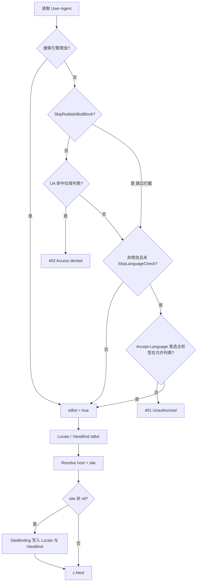

# sitesmiddleware

基于 [Fiber v3](https://github.com/gofiber/fiber) 的站点解析中间件：**不依赖任何 ORM 或业务模型**，通过泛型 `S` 与 `SiteBinding` 注入「站点」类型与字段访问方式。

---

## 执行逻辑（顺序固定）

中间件对每个请求按下面顺序执行；任一步提前返回则**不会**执行后续步骤。



### 步骤说明

| 顺序 | 逻辑 | 结果 |
|------|------|------|
| 1 | `IsSearchEngineBot`（`BotUserAgents` 或 `DefaultBotUserAgents`） | 得到 `isBot`，后续语言规则仅对**非爬虫**生效 |
| 2 | 若 **`SkipRubbishBotBlock == false`**：`IsRubbishBotWithList`（`RubbishBotUserAgents` 或 `DefaultRubbishBotSubstrings`） | 命中则 **403**，不再往下 |
| 3 | 若 **`!isBot && !SkipLanguageCheck`**：`IsPreferredLanguage`（`PreferredLanguageTags` 或 `DefaultPreferredLanguageTags`） | 不通过则 **401** |
| 4 | `Resolve` | 得到 `host`、`site` |
| 5 | `site != nil` 时通过 `SiteBinding` 写入上下文并 `ViewBind` | 见下表 |
| 6 | `c.Next()` | 进入后续中间件 / 路由 |

---

## 功能概览

| 行为 | 说明 |
|------|------|
| 搜索引擎爬虫 | 按 `BotUserAgents`（可选）或 `DefaultBotUserAgents`；写入 `Locals("isBot")` 与 `ViewBind["isBot"]` |
| 垃圾爬虫 | 默认启用拦截；`SkipRubbishBotBlock` 可关闭；列表可自定义 `RubbishBotUserAgents` 或使用 `DefaultRubbishBotSubstrings` |
| 非爬虫语言 | 默认校验首选语言 ∈ `DefaultPreferredLanguageTags`（`zh`）；`SkipLanguageCheck` 可关闭；`PreferredLanguageTags` 可自定义允许多语言 |
| 站点解析 | `Resolve` 返回 `host` 与 `*S`；非 `nil` 时写入 `Locals` / `ViewBind`（见下表） |

### 解析到站点后写入的上下文

| 键 | 类型 | 说明 |
|----|------|------|
| `ctx` | `fiber.Ctx` | 当前请求上下文 |
| `site` | `*S` | 当前站点指针 |
| `siteID` | `uint` | `SiteBinding.SiteID(site)` |
| `host` | `string` | 当前请求的 host（不含端口） |
| `Theme` | `string` | 模板名 |
| `ThemePath` | `string` | `template/` + 模板名 |

`ViewBind` 中会额外包含：`ctx`、`siteBase`（同 `site`）、`siteID`、`Theme`、`ThemePath`。

---

## 依赖与安装

```go
go get github.com/muzidudu/go_utils/sitemiddleware
```

需 **Go 1.18+**（泛型）。

在业务项目中使用本仓库的本地副本时，可在 `go.mod` 中增加：

```go
replace github.com/muzidudu/go_utils/sitemiddleware => ../path/to/go_utils/sitemiddleware
```

---

## API 说明

### `Options[S]`

| 字段 | 默认值 / 行为 |
|------|----------------|
| `SiteBinding` | 在 `Resolve` 返回非 `nil` 站点时**必须**提供 `SetHost`、`SiteID`、`Template` |
| `BotUserAgents` | 可选；nil 或返回空切片则使用 `DefaultBotUserAgents` |
| `SkipRubbishBotBlock` | `false`：启用垃圾 UA 拦截；`true`：不拦截 |
| `RubbishBotUserAgents` | 可选；nil 或返回空切片则使用 `DefaultRubbishBotSubstrings` |
| `SkipLanguageCheck` | `false`：非爬虫会校验 `Accept-Language`；`true`：不校验 |
| `PreferredLanguageTags` | 非爬虫校验时使用；**nil 或空切片** 时视为使用 `DefaultPreferredLanguageTags`（`["zh"]`） |
| `Resolve` | **必填**。返回 `(host, site)` |

### `SiteBinding[S]`

- `SetHost(s *S, host string)` — 一般写入请求级 host（如 `s.Host = host`）
- `SiteID(s *S) uint`
- `Template(s *S) string` — 用于拼 `ThemePath`

### `New[S](opts Options[S]) fiber.Handler`

注册中间件：`app.Use(sitesmiddleware.New(opts))`。

### `GetSite[S](c, defaultSite)`

从 `Locals("site")` 读取 `*S`；若不存在且提供了 `defaultSite`，则回退。

### 辅助函数（可单独使用）

- `DefaultHostFromRequest(c)` — 规范化 Host（小写、去端口）
- `IsSearchEngineBot(c, userAgent, botUserAgents)`
- `IsRubbishBot(userAgent)` — 使用 `DefaultRubbishBotSubstrings`
- `IsRubbishBotWithList(userAgent, substrings)`
- `PrimaryLanguageTag(acceptLanguage)` — 首选语言主标签
- `IsPreferredLanguage(acceptLanguage, allowed)`
- `IsChinesePreferredLanguage(acceptLanguage)` — 等价于仅允许 `zh`

---

## 控制开关与配置示例

### 仅允许中英文用户（非爬虫）

```go
sitesmiddleware.Options[models.Site]{
	// ...
	SkipLanguageCheck:     false,
	PreferredLanguageTags: []string{"zh", "en"},
}
```

### 关闭语言校验（国际化站点，非爬虫不挡）

```go
SkipLanguageCheck: true,
```

### 关闭垃圾 UA 拦截（调试或内网）

```go
SkipRubbishBotBlock: true,
```

### 自定义垃圾 UA 列表（例如从配置读取）

```go
RubbishBotUserAgents: func(c fiber.Ctx) []string {
	return myConfig.RubbishUserAgentSubstrings
},
```

---

## 示例一：配合业务模型（如 GORM `models.Site`）

```go
package myapp

import (
	"github.com/gofiber/fiber/v3"
	"github.com/muzidudu/go_utils/fiber/internal/models"
	"github.com/muzidudu/go_utils/fiber/pkg/sitesmiddleware"
)

func SiteMiddleware(resolve func(fiber.Ctx) (string, *models.Site)) fiber.Handler {
	return sitesmiddleware.New(sitesmiddleware.Options[models.Site]{
		SiteBinding: sitesmiddleware.SiteBinding[models.Site]{
			SetHost: func(s *models.Site, host string) {
				s.Host = host
			},
			SiteID: func(s *models.Site) uint {
				return s.ID
			},
			Template: func(s *models.Site) string {
				return s.Template
			},
		},
		BotUserAgents: nil,
		Resolve: func(c fiber.Ctx) (string, *models.Site) {
			return resolve(c)
		},
	})
}
```

**类型参数注意**：`Options` 的泛型是 **站点值类型** `models.Site`，不是 `*models.Site`。`Resolve` 返回的仍是 `*models.Site`（即 `*S`）。

---

## 示例二：不使用 ORM 模型，自定义轻量结构体

```go
package myapp

import (
	"github.com/gofiber/fiber/v3"
	"github.com/muzidudu/go_utils/fiber/pkg/sitesmiddleware"
)

type SiteLite struct {
	ID       uint
	Name     string
	Template string
	Host     string
}

func ExampleLite() fiber.Handler {
	byHost := map[string]*SiteLite{
		"www.example.com": {ID: 1, Name: "主站", Template: "default"},
	}

	return sitesmiddleware.New(sitesmiddleware.Options[SiteLite]{
		SiteBinding: sitesmiddleware.SiteBinding[SiteLite]{
			SetHost: func(s *SiteLite, host string) {
				s.Host = host
			},
			SiteID: func(s *SiteLite) uint {
				return s.ID
			},
			Template: func(s *SiteLite) string {
				return s.Template
			},
		},
		SkipLanguageCheck: true,
		Resolve: func(c fiber.Ctx) (string, *SiteLite) {
			host := sitesmiddleware.DefaultHostFromRequest(c)
			if site, ok := byHost[host]; ok {
				return host, site
			}
			return host, nil
		},
	})
}
```

---

## 小结

- 库内**不**定义「站点」长什么样，只约定通过 `SiteBinding` 读写的三个语义。
- 垃圾拦截、语言策略均可通过 `Options` 开关与列表配置，**默认行为**与旧版一致：拦垃圾 UA、非爬虫仅允许首选语言 `zh`。
